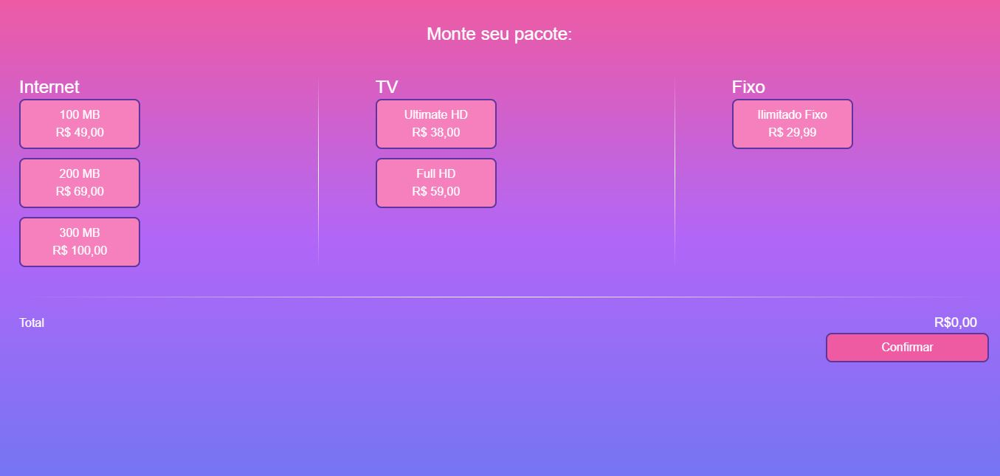

# Carrinho de Compras




> Carrinho de compras desenvolvido em Vue.js com listagem de produtos por categoria (internet, tv, telefone fixo), e permissão de selecionar apenas um produto por categoria, sendo a seleção da categoria internet obrigatória. Inclusão e atualização de preço de forma automática do carrinho, com a possibilidade de remoção dos itens, usando layout responsivo e dentro dos padrões de código Vue.js. Rodando em um container isolado, através do Docker.


## 💻 Pré-requisitos

Antes de começar, verifique se você atendeu aos seguintes requisitos:

* Você instalou o WSL2 em sua máquina, caso utilize o Windows.
* Você instalou o Docker em sua máquina.

## 🚀 Instalando cart-shop

Para instalar o cart-shop, siga estas etapas:

```
docker-compose build --no-cache
```

## ☕ Usando cart-shop

Para usar cart-shop, siga estas etapas:

```
docker-compose up
```

## ☕ Desligando cart-shop

Para desligar cart-shop, siga estas etapas:

```
docker-compose down
```


## 📫 Contribuindo para cart-shop

Para contribuir com cart-shop, siga estas etapas:

1. Bifurque este repositório.
2. Crie um branch: `git checkout -b <nome_branch>`.
3. Faça suas alterações e confirme-as: `git commit -m '<mensagem_commit>'`
4. Envie para o branch original: `git push origin cart-shop / <local>`
5. Crie a solicitação de pull.

Como alternativa, consulte a documentação do GitHub em [como criar uma solicitação pull](https://help.github.com/en/github/collaborating-with-issues-and-pull-requests/creating-a-pull-request).


## 📝 Licença

Esse projeto está sob licença. Veja o arquivo [LICENÇA](LICENSE.md) para mais detalhes.

[⬆ Voltar ao topo](#cart-shop)<br>
